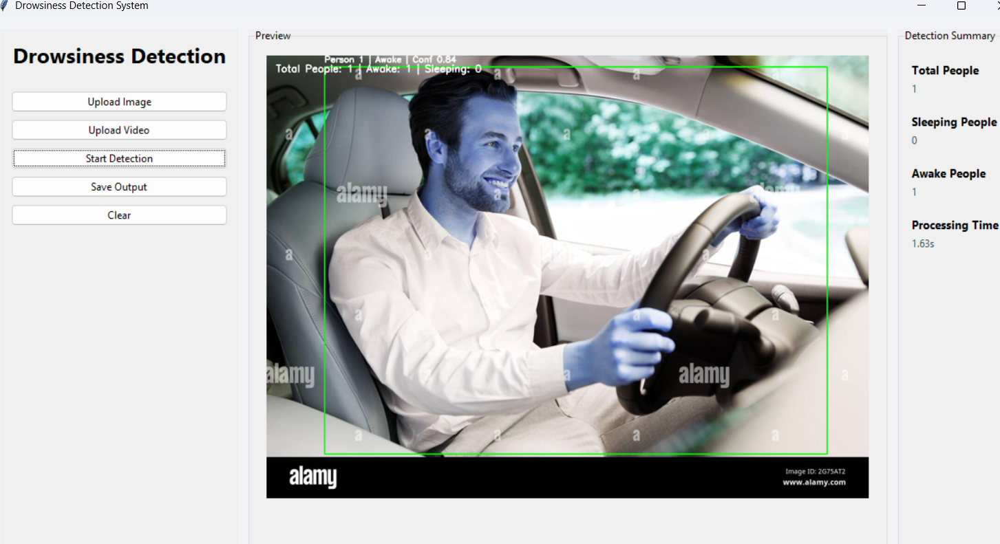
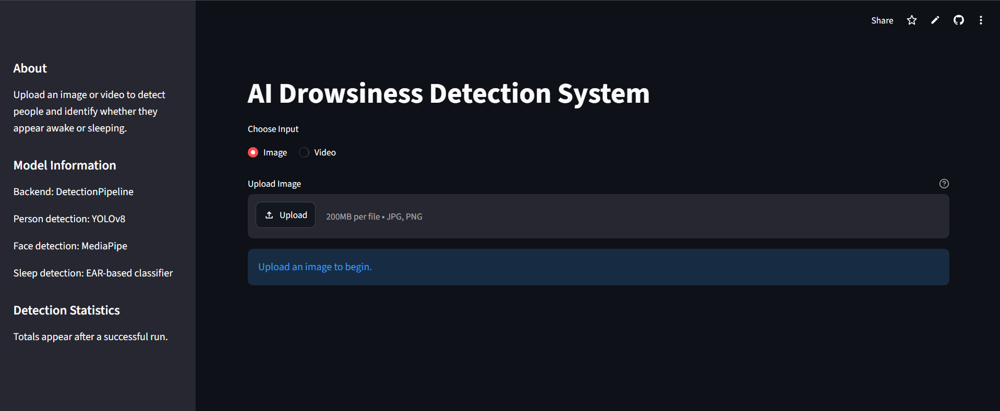
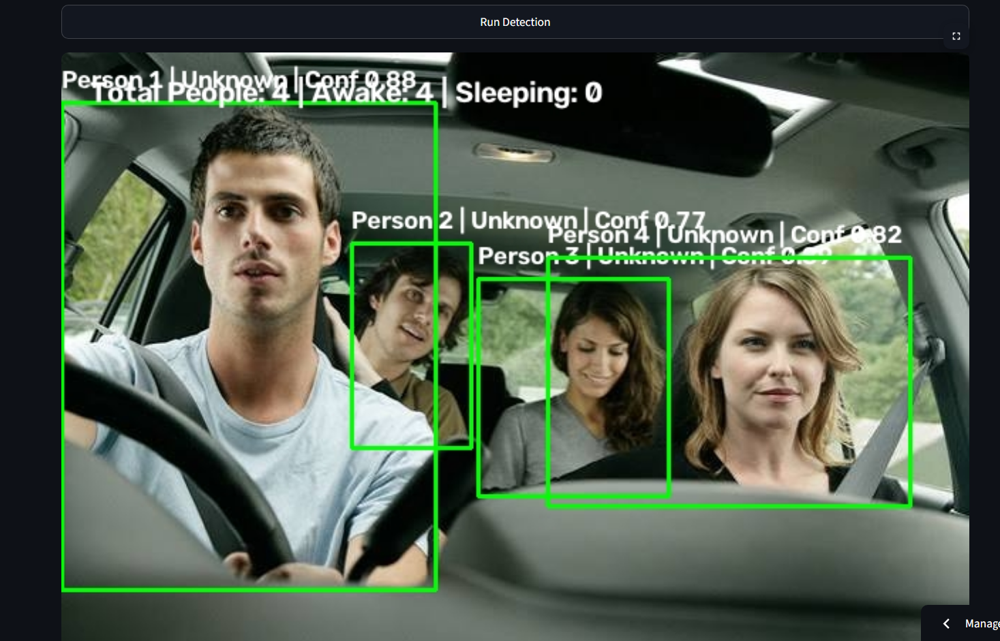

<div align="center">

# 🚗 AI Drowsiness Detection System

### AI-Powered Driver Drowsiness Detection using YOLOv8, MediaPipe & OpenCV

<p>
An intelligent Computer Vision system capable of detecting awake and sleeping drivers from images and videos with a production-ready Desktop and Web interface.
</p>


</div>

---

# 📖 Overview

Driver drowsiness is one of the leading causes of road accidents worldwide. This project uses **Deep Learning** and **Computer Vision** techniques to monitor drivers and identify signs of drowsiness by analyzing eye landmarks.

The application supports both **single-person** and **multi-person** scenarios and provides real-time visual feedback through annotated images and videos.

---

# ✨ Key Features

- 🚗 Driver Drowsiness Detection
- 👥 Multiple Person Detection
- 😀 Face Detection using MediaPipe
- 👁 Eye Aspect Ratio (EAR) Based Sleep Detection
- 🧠 Intelligent Detection Pipeline
- 🎥 Video Processing
- 🖼 Image Processing
- 📊 Detection Summary
- 🎯 Confidence Score
- 🖍 Bounding Box Visualization
- 💻 Tkinter Desktop GUI
- 🌐 Streamlit Web Interface
- 📁 Automatic Output Saving

---

# 🖼 Demo

## Desktop GUI

<p align="center">



</p>

---

## Streamlit Web App

<p align="center">



</p>

---

## Detection Output

<p align="center">



</p>


---

# 🏗 System Architecture

```text
                Input Image / Video
                        │
                        ▼
          YOLOv8 Person Detection
                        │
                        ▼
         MediaPipe Face Detection
                        │
                        ▼
      Facial Landmark Extraction
                        │
                        ▼
       Eye Aspect Ratio Calculation
                        │
                        ▼
      Awake / Sleeping Classification
                        │
                        ▼
      Detection Summary + Annotation
                        │
                        ▼
         Save Processed Output
```

---

# 🛠 Tech Stack

| Category | Technology |
|------------|------------|
| Language | Python |
| Object Detection | YOLOv8 |
| Face Detection | MediaPipe |
| Image Processing | OpenCV |
| Deep Learning | PyTorch |
| Numerical Computing | NumPy |
| Desktop GUI | Tkinter |
| Web Interface | Streamlit |
| Visualization | Matplotlib |

---

# 📂 Project Structure

```text
Drowsiness-Detection-System
│
├── assets/
│   ├── sample_images/
│   └── sample_videos/
│
├── config/
│
├── gui/
│
├── inference/
│   ├── detect_person.py
│   ├── detect_face.py
│   ├── detect_sleep.py
│   ├── detect_age.py
│   ├── detect_image.py
│   ├── detect_video.py
│   └── pipeline.py
│
├── services/
│
├── tests/
│
├── training/
│
├── utils/
│
├── streamlit_app.py
├── main.py
├── requirements.txt
└── README.md
```

---

# 🚀 Installation

Clone Repository

```bash
git clone https://github.com/Minakshi-kaushik/drowsiness-detection-system.git

cd drowsiness-detection-system
```

Create Virtual Environment

```bash
python -m venv venv
```

Activate Environment

Windows

```bash
venv\Scripts\activate
```

Linux / macOS

```bash
source venv/bin/activate
```

Install Dependencies

```bash
pip install -r requirements.txt
```

---

# ▶ Running the Application

### Desktop GUI

```bash
python main.py
```

---

### Streamlit

```bash
streamlit run streamlit_app.py
```

---

# 📊 Detection Pipeline

✔ Person Detection

↓

✔ Face Detection

↓

✔ Eye Landmark Extraction

↓

✔ EAR Calculation

↓

✔ Sleep Detection

↓

✔ Detection Summary

↓

✔ Annotated Output

---

# 📈 Sample Detection

| Metric | Value |
|----------|---------|
| Total People | 1 |
| Sleeping | 0 |
| Awake | 1 |
| Confidence | 84.2% |
| EAR | 0.407 |

---

# 📁 Output

Generated outputs are automatically saved inside:

```text
outputs/images/
outputs/videos/
```

---

# 🎯 Future Scope

- ✅ Live Webcam Detection
- ✅ Driver Alert Alarm
- ✅ Head Pose Estimation
- ✅ Blink Rate Analysis
- ✅ Face Recognition
- ✅ Driver Fatigue Score
- ✅ Mobile Application
- ✅ Cloud Deployment

---

# 🤝 Contributing

Contributions are always welcome.

1. Fork the repository

2. Create your feature branch

```bash
git checkout -b feature-name
```

3. Commit changes

```bash
git commit -m "Add new feature"
```

4. Push

```bash
git push origin feature-name
```

5. Create a Pull Request

---

# 📜 License

This project is developed for educational and research purposes.

---

# 👩‍💻 Author

## **Minakshi Kaushik**

**B.Tech Computer Science Engineering**

**Indira Gandhi Delhi Technical University for Women (IGDTUW)**

GitHub:
https://github.com/Minakshi-kaushik

---

<div align="center">

### ⭐ If you like this project, don't forget to Star the repository!

</div>