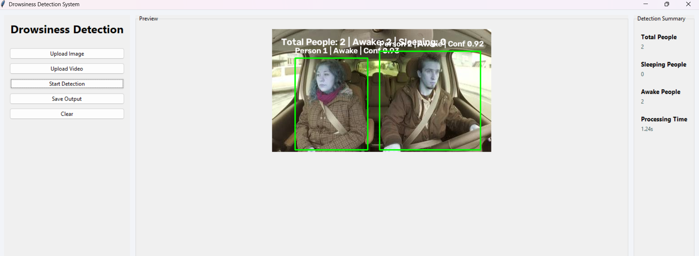

# 💤 AI Drowsiness Detection System

> An AI-powered computer vision application that detects drowsiness in people from images and videos using YOLOv8, MediaPipe Face Mesh, and Eye Aspect Ratio (EAR) analysis.

---

## 📌 Overview

The **AI Drowsiness Detection System** is a computer vision application designed to detect whether a person is **Awake** or **Drowsy** from uploaded images and videos.

The system combines **YOLOv8** for person detection, **MediaPipe Face Mesh** for facial landmark extraction, and **Eye Aspect Ratio (EAR)** analysis to determine eye closure and identify signs of drowsiness.

The project is available as both a **Desktop Application (Tkinter)** and a **Web Application (Streamlit)** using a shared AI inference pipeline.

---

# ✨ Features

- ✅ Person Detection using YOLOv8
- ✅ Face Detection using MediaPipe
- ✅ Facial Landmark Extraction
- ✅ Eye Aspect Ratio (EAR) Calculation
- ✅ Drowsiness Detection
- ✅ Multiple Person Detection
- ✅ Image Detection
- ✅ Video Detection
- ✅ Desktop GUI (Tkinter)
- ✅ Web Application (Streamlit)
- ✅ Modular Production-Ready Architecture

---

# 🏗️ Project Architecture

```
Input Image / Video
        │
        ▼
YOLOv8 Person Detection
        │
        ▼
Crop Each Person
        │
        ▼
MediaPipe Face Detection
        │
        ▼
Face Landmark Detection
        │
        ▼
EAR Calculation
        │
        ▼
Sleep Classification
        │
        ▼
Annotated Output
```

---

# 📂 Project Structure

```
Drowsiness-Detection-System/
│
├── assets/
├── config/
├── datasets/
├── docs/
├── gui/
├── inference/
│   ├── detect_person.py
│   ├── detect_face.py
│   ├── detect_sleep.py
│   ├── detect_image.py
│   ├── detect_video.py
│   ├── detect_age.py
│   └── pipeline.py
│
├── logs/
├── models/
├── outputs/
├── services/
├── tests/
├── training/
├── utils/
│
├── main.py
├── streamlit_app.py
├── requirements.txt
└── README.md
```

---

# ⚙️ Tech Stack

### Programming Language

- Python 3.11+

### Computer Vision

- OpenCV
- MediaPipe

### Deep Learning

- YOLOv8 (Ultralytics)

### Machine Learning

- NumPy

### User Interface

- Tkinter
- Streamlit

### Utilities

- Pillow
- Logging
- pathlib

---

# 🚀 Installation

Clone the repository

```bash
git clone https://github.com/Minakshi-kaushik/drowsiness-detection-system

cd Drowsiness-Detection-System
```

Create a virtual environment

```bash
python -m venv venv
```

Activate the environment

### Windows

```bash
venv\Scripts\activate
```

### Linux / macOS

```bash
source venv/bin/activate
```

Install dependencies

```bash
pip install -r requirements.txt
```

---

# ▶️ Run Desktop Application

```bash
python main.py
```

---

# 🌐 Run Streamlit Application

```bash
streamlit run streamlit_app.py
```

---

# 📸 Supported Inputs

### Images

- JPG
- JPEG
- PNG

### Videos

- MP4
- AVI
- MOV

---

# 📊 Detection Output

For every detected person, the system provides:

- Person ID
- Bounding Box
- Face Detection Status
- Awake / Drowsy Classification
- Detection Confidence
- Eye Aspect Ratio (EAR)

---

# 📷 Sample Output


Example:

```
Original Image

↓

Person Detected

↓

Face Detected

↓

Status: Awake
Confidence: 84.2%
```

---

# 📦 Future Improvements

The project has been designed with a modular architecture to support future enhancements, including:

- Real-Time Webcam Detection
- Driver Monitoring System
- Audio Alarm for Drowsiness
- Face Recognition
- Age Prediction
- Emotion Detection
- Driver Analytics Dashboard
- Cloud Deployment
- Mobile Application

---

# 🧪 Testing

Run all tests using:

```bash
pytest
```

---

# 📜 License

This project is intended for educational, research, and portfolio purposes.

---

# 👩‍💻 Author

**Minakshi Kaushik**

B.Tech Computer Science Engineering (CSE)

Indira Gandhi Delhi Technical University for Women (IGDTUW)

---

# ⭐ If you found this project useful, consider giving it a star on GitHub!